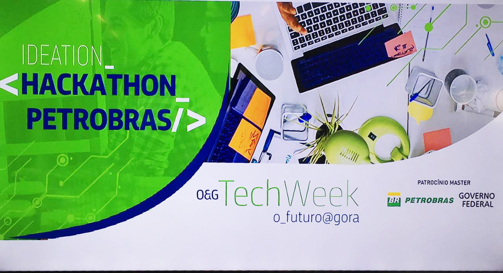

# Ideation-Hackathon-Petrobras-
<h3>Hackathon of ideas from petrobras, where we present the ideas and solutions for the logistics area.</h3>

<h3>Hackathon of ideas from petrobras, where we present the ideas and solutions for the logistics area.

We are developing a solution that will attack the problem in the logistics area.
PIC and Manual Separation
Where service providers perform manual separation and checking of inputs to be delivered to the plants. Generating problems like:
- Wrong materials
- Missing Materials
- Deliveries on exchanged platforms
- Delivery Delay
- Deley 7 days<h3>